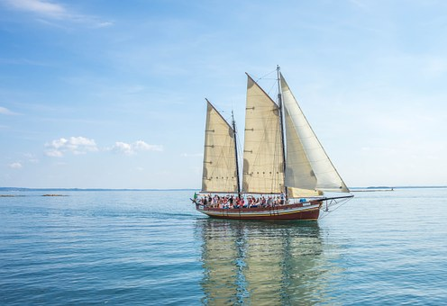

## O Captain! My Captain!
*Walt Whitman*
<link href="../styles/style.css" rel="stylesheet"></link>

O Captain! my Captain! our fearful trip is done;1  
The ship has weather’d every rack, the prize we sought is won,  
The port is near, the bells I hear, the people all exulting,  
While follow eyes the steady keel, the vessel grim and daring;  
&nbsp; &nbsp; &nbsp; &nbsp; But O heart! heart! heart!  
&nbsp; &nbsp; &nbsp; &nbsp; &nbsp; &nbsp; O the bleeding drops of red,  
&nbsp; &nbsp; &nbsp; &nbsp; &nbsp; &nbsp; &nbsp; &nbsp; Where on the deck my Captain lies,  
&nbsp; &nbsp; &nbsp; &nbsp; &nbsp; &nbsp; &nbsp; &nbsp; &nbsp; &nbsp; Fallen cold and dead.  

O Captain! my Captain! rise up and hear the bells; 
Rise up—for you the flag is flung—for you the bugle2 trills,  
For you bouquets and ribbon’d wreaths—for you the shores a-crowding,  
For you they call, the swaying mass, their eager faces turning;  
&nbsp; &nbsp; &nbsp; &nbsp; Here Captain! dear father!  
&nbsp; &nbsp; &nbsp; &nbsp; &nbsp; &nbsp; This arm beneath your head!  
&nbsp; &nbsp; &nbsp; &nbsp; &nbsp; &nbsp; &nbsp; &nbsp; It is some dream that on the deck,  
&nbsp; &nbsp; &nbsp; &nbsp; &nbsp; &nbsp; &nbsp; &nbsp; &nbsp; &nbsp; You’ve fallen cold and dead.  

My Captain does not answer, his lips are pale and still,3  
My father does not feel my arm, he has no pulse nor will,  
The ship is anchor’d safe and sound, its voyage closed and done,  
From fearful trip the victor ship comes in with object won;  
&nbsp; &nbsp; &nbsp; &nbsp; Exult O shores, and ring O bells!  
&nbsp; &nbsp; &nbsp; &nbsp; &nbsp; &nbsp; But I with mournful tread,  
&nbsp; &nbsp; &nbsp; &nbsp; &nbsp; &nbsp; &nbsp; &nbsp; Walk the deck my Captain lies,  
&nbsp; &nbsp; &nbsp; &nbsp; &nbsp; &nbsp; &nbsp; &nbsp; &nbsp; &nbsp; Fallen cold and dead.  

 

---

## Footnotes

1 The author had just landed in La Guardia Airport after the flight captain died. All the passengers stood up to applaud the co-pilot. We have it in good authority that the event in question led Yoko Ono to write her "Letter to John":

*On a windy day let's go flying*  
*There may be no trees to rest on*  
*There may be no clouds to ride*  
*But we'll have our wings and the wind will be with us*  
*That's enough for me, that's enough for me.*

2 The bugle is a small trumpet implicated in the military industrial complex.

3 Another footnote. Why not? 

